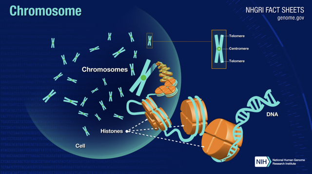

Discovers [structural variation](https://www.ncbi.nlm.nih.gov/dbvar/content/overview/) using the [LUMPY](https://github.com/arq5x/lumpy-sv) Express tool.

# Context
A prominent source of [human genetic variation](https://en.wikipedia.org/wiki/Human_genetic_variation) (the genetic differences in and among populations) are differences in [chromosome](https://www.genome.gov/about-genomics/fact-sheets/Chromosomes-Fact-Sheet) structure. These differences are collectively known as [structural variation](https://www.ncbi.nlm.nih.gov/dbvar/content/overview/) (SV), a term that encompasses diverse genomic alterations including [deletion](https://en.wikipedia.org/wiki/Deletion_(genetics)), [duplication](https://www.genome.gov/genetics-glossary/Duplication), [insertion](https://www.genome.gov/genetics-glossary/Insertion), [inversion](https://en.wikipedia.org/wiki/Chromosomal_inversion), [translocation](https://www.genome.gov/genetics-glossary/Translocation) or complex [rearrangement](https://learn.genetics.utah.edu/content/disorders/rearrangements) of relatively large (for example, >100 bp) segments. For detailed information about the types of structural variations, please check out the *[Variant Call and RegionTypes](https://www.ncbi.nlm.nih.gov/dbvar/content/overview/#datamodel)* table in the "[Overview of Structural Variation](https://www.ncbi.nlm.nih.gov/dbvar/content/overview/)" page on the [NCBI](https://www.ncbi.nlm.nih.gov/) (The National Center for Biotechnology Information) website. 


*DNA and histone proteins are packaged into structures called chromosomes:*



*Picture credits: [Chromosomes Fact Sheet by NIH](https://www.genome.gov/about-genomics/fact-sheets/Chromosomes-Fact-Sheet).*


*Genomic alterations:*

  

*Picture credits: [Chromosome Abnormalities Fact Sheet by NIH](https://www.genome.gov/about-genomics/fact-sheets/Chromosome-Abnormalities-Fact-Sheet)* 


While SVs are considerably less common than smaller-scale forms of genetic variation such as [single nucleotide polymorphisms](https://medlineplus.gov/genetics/understanding/genomicresearch/snp/) (SNPs), they have greater functional potential due to their larger size, and they are more likely to alter gene structure or dosage ([Layer et al., 2014](https://genomebiology.biomedcentral.com/articles/10.1186/gb-2014-15-6-r84)). The discovery and [genotyping](https://en.wikipedia.org/wiki/Genotyping) (determining differences in the genetic make-up) of SV from DNA sequence data have lagged far behind SNP discovery and genotyping because they are fundamentally more complex. SVs vary considerably in size, architecture and genomic context, and [read alignment](https://docs.gdc.cancer.gov/Encyclopedia/pages/Aligned_Reads/) accuracy is compromised near SVs by the presence of novel junctions (that is, breakpoints) between the sample and the reference genome. 

*Examples of "junctions" or "breakpoints":*


*Picture credits: [Structural variation](http://schatzlab.cshl.edu/teaching/2015/2015.AdvSeq.Structural_variants_Maria_Nattestad.pdf).*

Moreover, SVs generate multiple alignment signals, including altered sequence coverage within duplications or deletions (read-depth), breakpoint-spanning [paired-end](https://www.illumina.com/science/technology/next-generation-sequencing/plan-experiments/paired-end-vs-single-read.html) reads that align discordantly relative to each other (read-pair), and breakpoint-containing single reads that align in split fashion to [discontiguous](https://medical-dictionary.thefreedictionary.com/discontinuous+gene) [loci](https://www.genome.gov/genetics-glossary/Locus) in the reference genome (split-read). 

*3 ways to detect a structural variant (SV):*

")

*Picture credits: [Structural variation](http://schatzlab.cshl.edu/teaching/2015/2015.AdvSeq.Structural_variants_Maria_Nattestad.pdf).*

These diverse alignment signals are difficult to integrate and most algorithms use just one signal. Other methods use two signals, but these limit initial detection to one signal and use the second to add [confidence](https://www.investopedia.com/terms/c/confidenceinterval.asp), refine breakpoint intervals, or genotype additional samples ([Layer et al., 2014](https://genomebiology.biomedcentral.com/articles/10.1186/gb-2014-15-6-r84)).

An approach that integrates multiple signals allows for more sensitive SV discovery than methods that examine merely one signal, especially when considering [heterogeneous](https://www.statisticshowto.com/heterogeneity/) samples and/or low coverage data, because each individual read generally produces only one signal type (for example, read-pair or split-read, but not both). The impact of improved sensitivity is particularly acute in low coverage datasets or in studies of heterogeneous cancer samples where any given variant may only be present in a subset of cells. However, even with high coverage data, integration of multiple signals can increase specificity by allowing for more stringent criteria for reporting a variant call. Such integration of multiple signals has been achieved by [LUMPY](https://github.com/arq5x/lumpy-sv).

This tool is based on the `lumpyexpress` function/method. The LUMPY Express tool (`lumpyexpress`) is used for automated breakpoint detection in standard analyses. LUMPY Express expects one or more [BWA-MEM](http://bio-bwa.sourceforge.net/bwa.shtml) aligned [BAM](https://samtools.github.io/hts-specs/SAMv1.pdf) files as input. It automatically parses sample, library, and read group information using the @RG tags in the BAM header. Each BAM file is expected to contain exactly one sample. The minimum input is a coordinate-sorted BAM file (`bamFile`), from which LUMPY Express extracts splitters and discordants using [SAMBLASTER](https://github.com/GregoryFaust/samblaster) before running LUMPY. Optionally, users may supply coordinate-sorted splitter (`bamSplitReadsFile`) and discordant (`bamDiscReadsFile`) BAM files which will bypass SAMBLASTER extraction for faster analysis. LUMPY Express produces a [VCF](https://samtools.github.io/hts-specs/VCFv4.2.pdf) file according to [VCF spec 4.2](https://samtools.github.io/hts-specs/VCFv4.2.pdf).

## LUMPY Framework

[LUMPY](https://genomebiology.biomedcentral.com/articles/10.1186/gb-2014-15-6-r84) is a novel and general probabilistic SV discovery framework that naturally integrates multiple SV detection signals, including those generated from read alignments or prior evidence into a single discovery process. In LUMPY, a *breakpoint* is defined as a pair of bases that are adjacent in an experimentally sequenced sample genome but not in the reference genome. Since different types of alignment evidence have different genomic resolution levels, a *breakpoint* in LUMPY is represented with a pair of probability distributions spanning the predicted breakpoint regions. The probability distributions reflect the relative uncertainty that a given position in the reference genome represents one end of the breakpoint.

*The LUMPY framework for integrating multiple structural variation signals:*


*Picture credits: [LUMPY publication](https://genomebiology.biomedcentral.com/articles/10.1186/gb-2014-15-6-r84).*

The LUMPY framework provides distinct modules that map signals from each alignment evidence type to the common probability interval pair. For example, [paired-end](https://www.illumina.com/science/technology/next-generation-sequencing/plan-experiments/paired-end-vs-single-read.html) sequence alignments are projected to a pair of intervals [upstream or downstream](https://pediaa.com/what-is-the-difference-between-upstream-and-downstream-dna/) (depending on orientation) of the mapped reads (Figure A). The size of the intervals and the probability at each position is based on the [empirical size](https://stats.stackexchange.com/questions/190791/what-is-the-empirical-size-of-a-test) distribution of the sample’s [DNA fragment library](https://www.sciencedirect.com/topics/biochemistry-genetics-and-molecular-biology/dna-library) (a population of DNA fragments ready for sequencing). The distinct advantage of this approach is that any type of evidence can be considered, as long there exists a direct mapping from the SV signal to a breakpoint probability distribution. LUMPY provides three modules for converting SV signals to probability distributions: **read-pair**, **split-read**, and **generic**.

Once the evidence from the different alignment signals is mapped to breakpoint intervals, overlapping intervals are clustered and the probabilities are integrated. Any clustered breakpoint region that contains sufficient evidence (based on user-defined arguments) is returned as a predicted SV. *The resolution of the predicted breakpoint regions can be improved by trimming the positions with probabilities in the lower percentile of the distribution (for example, the lowest 0.1%).*

It is well established that variant calling is improved by integrating data from multiple samples ([Layer et al., 2014](https://genomebiology.biomedcentral.com/articles/10.1186/gb-2014-15-6-r84)). The LUMPY framework naturally handles multiple samples by tracking the sample origin of each probability distribution during clustering (Figure B). As an example of a typical analysis, LUMPY can identify SVs in a whole-genome, 50X coverage [paired-end Illumina](https://www.illumina.com/science/technology/next-generation-sequencing/plan-experiments/paired-end-vs-single-read.html) dataset from the [NA12878 CEPH](https://www.ebi.ac.uk/ena/browser/view/PRJEB3246) individual in 12.2 hours using 8 Gb of memory using a single processor.

LUMPY has been implemented in an [open source](https://opensource.com/resources/what-open-source) [C++](https://www.cplusplus.com/) software package (available [here](https://github.com/arq5x/lumpy-sv)) that is capable of detecting SV from multiple alignment signals in [BAM](https://samtools.github.io/hts-specs/SAMv1.pdf) files from one or more samples.

# Inputs

## Required inputs

This tool has the following **required** input:

1. **`bamBaiFiles`**

    Coordinate-sorted [BAM](https://samtools.github.io/hts-specs/SAMv1.pdf) file(s) in which structural variations are to be detected and corresponding index BAI file(s).

    1.1 **`bamFile`**

    An array of coordinate-sorted BAM file(s) in which structural variations are to be detected.

    1.2 **`baiFile`**

    An array of file(s) containing the index for the BAM file(s) (`bamFile`). This is an *optional* input.

## Optional inputs

This tool provides additional configuration through the following **optional** inputs:

1. **`bamExtractFiles`**

    Coordinate-sorted splitter and discordant BAM files which will bypass [SAMBLASTER](https://github.com/GregoryFaust/samblaster) extraction for faster analysis.

    1.1 **`bamSplitReadsFile`**
 
    An array of coordinate-sorted splitter reads BAM file(s).
 
    1.2 **`bamDiscReadsFile`**
 
    An array of discordant reads BAM file(s).

2. **`blackListBed`**

    [BED](https://genome.ucsc.edu/FAQ/FAQformat.html#format1) file containing regions to ignore.

3. **`outputProb`**

    Boolean value to output probability curves for each variant (default: `false`).

4. **`minSampleWt`**

    Minimum sample weight for a call (default: `4`).

5. **`trimThreshold`**

    The trimming threshold. The resolution of the predicted breakpoint regions can be improved by trimming the positions with probabilities in the lower percentile of the distribution (for example, the lowest 0.1%) (default: `0`).

7. **`keepTempFiles`**

    Boolean value to output temporary files (default: `false`).

9. **`outputPrefix`**

    Name for the output file (default: `fullBam.bam`).

# Outputs

## Required outputs

This tool will **always** provide the following output:

1. **`vcfFile`**

    The output [VCF](https://samtools.github.io/hts-specs/VCFv4.2.pdf) file containing the structural variants detected. 

## Optional outputs

This tool **optionally** provides the following output:

1. **`tempFiles`**

    The folder containing temporary files if the `keepTempFiles` parameter is set to `true`.

    This folder contains two files:

      i. A file containing the statistics from the analysis. These statistics include the mean and standard deviation.

      ii. A file containing the histogram metrics/values.

    If the `bamExtractFiles` parameter has *not* been provided, this folder contains additional files such as the coordinate-sorted splitter reads BAM file(s) and discordant reads BAM file(s) generated using [SAMBLASTER](https://github.com/GregoryFaust/samblaster). 

# Example
## Get input data
Download sample [BAM](https://samtools.github.io/hts-specs/SAMv1.pdf) and corresponding index BAI files from the [The International Genome Sample Resource](https://www.internationalgenome.org/) repository. The examples below use a subset of reads from the [NA12045](https://www.internationalgenome.org/data-portal/sample/NA12045) and [NA21144](https://www.internationalgenome.org/data-portal/sample/NA21144) samples, containing reads for the chromosome 20 only. Use the commands shown below to download these files:

For sample NA12045:
```console
wget ftp://ftp.1000genomes.ebi.ac.uk/vol1/ftp/phase3/data/NA12045/exome_alignment/NA12045.chrom20.ILLUMINA.bwa.CEU.exome.20121211.bam
wget ftp://ftp.1000genomes.ebi.ac.uk/vol1/ftp/phase3/data/NA12045/exome_alignment/NA12045.chrom20.ILLUMINA.bwa.CEU.exome.20121211.bam.bai
```

For sample NA21144:
```console
wget ftp://ftp.1000genomes.ebi.ac.uk/vol1/ftp/phase3/data/NA21144/exome_alignment/NA21144.chrom20.ILLUMINA.bwa.GIH.exome.20121211.bam
wget ftp://ftp.1000genomes.ebi.ac.uk/vol1/ftp/phase3/data/NA21144/exome_alignment/NA21144.chrom20.ILLUMINA.bwa.GIH.exome.20121211.bam.bai
```

## Upload input data into BatchX
Use the following commands to upload the BAM and the BAI files to your BatchX file system:

For sample NA12045:
```console
bx cp NA12045.chrom20.ILLUMINA.bwa.CEU.exome.20121211.bam bx://test/lumpyexpress/
bx cp NA12045.chrom20.ILLUMINA.bwa.CEU.exome.20121211.bam.bai bx://test/lumpyexpress/
```

For sample NA21144:
```console
bx cp NA21144.chrom20.ILLUMINA.bwa.GIH.exome.20121211.bam bx://test/lumpyexpress/
bx cp NA21144.chrom20.ILLUMINA.bwa.GIH.exome.20121211.bam.bai bx://test/lumpyexpress/
```

## Submit job

### Example 1
Submit a job to get structural variations in the sample NA12045:
```console
bx submit -v=1 -m=8000 batchx@bioinformatics/lumpy-sv/lumpyexpress:1.1.1 '{
  "bamBaiFiles": {
    "bamFile": ["bx://test/lumpyexpress/NA12045.chrom20.ILLUMINA.bwa.CEU.exome.20121211.bam"],
    "baiFile": ["bx://test/lumpyexpress/NA12045.chrom20.ILLUMINA.bwa.CEU.exome.20121211.bam.bai"]
  }
}'
```

### Example 2
Submit a job to get structural variations in both the samples NA12045 and NA21144:
```console
bx submit -v=1 -m=8000 batchx@bioinformatics/lumpy-sv/lumpyexpress:1.1.1 '{
  "bamBaiFiles": {
    "bamFile": [
        "bx://test/lumpyexpress/NA12045.chrom20.ILLUMINA.bwa.CEU.exome.20121211.bam",
        "bx://test/lumpyexpress/NA21144.chrom20.ILLUMINA.bwa.GIH.exome.20121211.bam"
    ],
    "baiFile": [
        "bx://test/lumpyexpress/NA12045.chrom20.ILLUMINA.bwa.CEU.exome.20121211.bam.bai",
        "bx://test/lumpyexpress/NA21144.chrom20.ILLUMINA.bwa.GIH.exome.20121211.bam.bai"
    ]
  }
}'
```

# Links
* [LUMPY Github Repository](https://github.com/arq5x/lumpy-sv)
* [LUMPY publication](https://genomebiology.biomedcentral.com/articles/10.1186/gb-2014-15-6-r84)

# Tool versions
* **LUMPY:** 0.2.14
